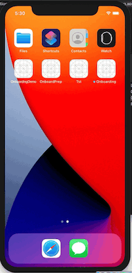

# Onboarding-SwiftUI2
Completed project for creating reusable Onboarding screens in SwiftUI V2

To see how this project was built, from scratch, please watch this video and subscribe to my YouTube Channel

